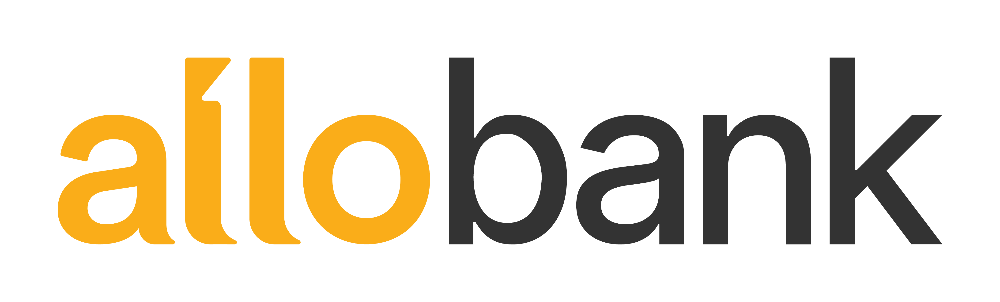
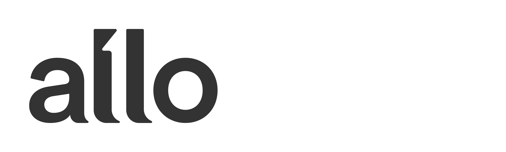
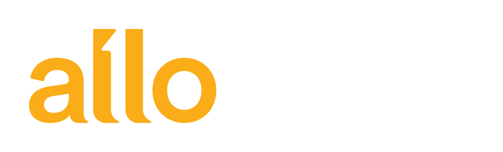
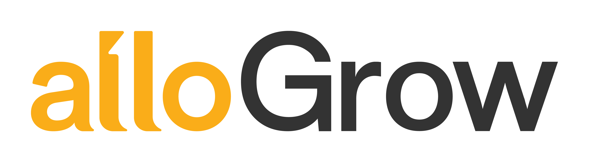

# Gamification Dashboard

The campaign dashboard lives in [`app/`](app/README.md). The brand assets and
design system documentation below support its UI.

## GitHub workflow

Repository: https://github.com/ghazylilhaq/gamification-dashboard

`origin` points to this repository and local `main` tracks `origin/main`.
Before starting work, run `git pull --ff-only`. To save and publish changes:

```bash
git add .
git commit -m "Describe your changes"
git push
```

Local environment files, dependencies, build output, and local databases are
ignored. Configure deployment passwords as Cloudflare Pages secrets; do not
commit them.

---

# Allo Bank — Design System

> _Mantra:_ **"Experience a Simple Life."**
> A pocket-sized digital bank from Indonesia that makes everyday money fun.

This is the brand & UI design system for **Allo Bank** (PT Allo Bank Indonesia Tbk., part of CT Corp). Use it to design any Allo-branded surface — marketing material, product mocks, slide decks, prototype screens, social posts, internal documents.

## Source

Built from official Allo Bank brand assets:
- `uploads/UPDATED VERSION - BRAND GUIDELINES Preview.pptx` — the official 2024/2025 Allo Bank Brand Guidelines deck (66 slides). Extracted into `assets/`.
- `uploads/Persentation Template.pptx` — official Allo Bank presentation template.
- **Real logo PNGs** (master mark, vertical, and 9 product logos) — in `assets/logo/` and `assets/products/`.
- **Real brand fonts** — Satoshi (full family) and Inter (full family) — in `fonts/`, loaded via `@font-face` in `colors_and_type.css`.
- **Presentation template assets** (yellow / black / white backgrounds + logo lockups) — in `assets/templates/`.

No codebase or Figma file was provided, so the **UI Kit is mocked from product moodboard slides + the brand fundamentals** — it is not a 1:1 copy of the live Allo app. Flag this when generating production-bound work.

---

## Index — what's in this folder

| Path | Purpose |
|------|---------|
| `README.md` | This file. Brand, content & visual fundamentals. |
| `SKILL.md` | Agent skill manifest. |
| `colors_and_type.css` | All color/type/spacing/radius/shadow tokens as CSS vars + base type styles. Import this in every new file. |
| `assets/` | Logo, color, type, photography, illustration, icon and product moodboard reference images. |
| `assets/logo/` | Real logo PNGs: `horizontal/01-color.png` … `06.png` (mono ink, color, mono yellow, alt color, yellow capsule, dark capsule), and `vertical/01.png` … `04.png`. Plus reference jpgs (usage rules, dos & don'ts). |
| `assets/products/` | Real product-logo PNGs for all 9 products: `pay/`, `pay-plus/`, `prime/`, `grow/`, `deposito/`, `paylater/`, `instant-cash/`, `explore/`, `bisnis/`. Each has `01.png` (mono ink, allo only) and `02.png` (full color, with product name). **Use `02.png` as the canonical product lockup.** |
| `assets/templates/` | Allo presentation template chrome — `template-bg-{yellow,black,white}.png` and `template-logo-{yellow,black,white}.png`. |
| `fonts/` | Real brand fonts — `Satoshi-{Light,Regular,Medium,Bold,Black,Italic,BoldItalic}` + `Inter-{Regular,Medium,SemiBold,Bold,Black}`. Loaded via `@font-face` in `colors_and_type.css`. |
| `assets/colors/` | Primary + secondary palette, logo on colored backgrounds. |
| `assets/type/` | Satoshi & Inter specimens, type combinations, type fails. |
| `assets/icons/` | Brand icon set + icon style references (outline / duotone / fill). |
| `assets/photography/` | Photo style: product-focus, lifestyle, photo-as-background. |
| `assets/illustrations/` | Spot illustrations, sticker pack, calendar applications, section dividers. |
| `assets/brand/` | Cover art and other miscellany. |
| `preview/` | The cards that render in the Design System tab — colors, type, components, etc. |
| `ui_kits/mobile-app/` | Allo mobile-app UI kit (best-effort reconstruction from moodboards). |

---

## Brand basics

- **Legal name:** PT Allo Bank Indonesia Tbk.
- **Parent group:** CT Corp.
- **Market:** Indonesia. Primary copy language is **Bahasa Indonesia**; English used for product names and marketing taglines.
- **Mantra / Tagline:** _"Experience a Simple Life"_ (also sometimes _"Hello Future"_).
- **Logotype:** "allobank" — set as a single lowercase wordmark. The `allo` part is **Allo Yellow** and the `bank` part is **Raisin Black**. Always lowercase. Always one word.
- **Sub-product logo formula:** the lowercase yellow `allo` wordmark + the product name in **UpperCamelCase Raisin Black** (e.g. _allo Pay_, _allo PayLater_, _allo Grow_, _allo Bisnis_, _allo Deposito_, _allo Explore_, _allo InstantCash_, _allo Prime_).

---

## CONTENT FUNDAMENTALS

Allo's voice is **friendly, encouraging, and human**. It talks _to_ users, not _at_ them. It assumes the reader is capable but busy, so it strips out jargon.

### Language

- **Primary language:** Bahasa Indonesia. ("Selamat datang di Allo Bank!", "Yuk, mulai sekarang", "Atur keuangan dengan mudah").
- **Secondary language:** English — used for product names, marketing taglines, hero copy, and global-facing surfaces.
- **Mixing is fine.** Indonesian users naturally code-switch; copy like _"Belanja sekarang, bayar nanti pakai Allo PayLater"_ is on-brand.

### Tone

- Warm, optimistic, slightly playful. Never corporate-cold.
- Encouraging the reader, not selling at them. Headlines talk about _the user's_ life: _"Atur uangmu, raih mimpimu."_
- Confident but humble — never boastful.
- Banking concepts are explained in plain words: "Tabungan yang berbunga harian" not "instrumen deposito harian."

### Person & address

- Use **"kamu"** (informal _you_), not the formal "Anda", except in legal/regulatory contexts.
- **First-person plural** (_kami_, _kita_) for the brand voice when talking about Allo as a partner, e.g. _"Kita bantu kamu nabung sambil belanja."_

### Casing

- Headlines: Sentence case (or all-lowercase as a stylistic device for hero moments, e.g. _"hello future."_).
- Buttons: Sentence case. ("Buka rekening", "Lanjutkan", "Top up sekarang").
- Brand wordmarks (`allobank`, `allo Pay`, `allo PayLater`): always exactly as specified — lowercase `allo` + product in UpperCamelCase.
- AVOID Shouty ALL-CAPS in body copy. Caps are reserved for tiny eyebrow/label text only.

### Punctuation & emoji

- One exclamation mark per paragraph max. Allo is enthusiastic, not desperate.
- **Emoji use is rare and intentional.** The brand prefers its own custom illustrations + sticker pack over emoji. If emoji are used at all, it's in social media captions, never inside the app UI.
- Em-dash and ellipsis fine; avoid loud typographic flourishes.

### Examples

| ✅ On brand | ❌ Off brand |
|------------|-------------|
| "Yuk, mulai nabung dari Rp10.000." | "Open a savings account today!!!" |
| "Belanja sekarang, bayar nanti." | "Utilize our Buy Now, Pay Later facility." |
| "Atur uangmu, raih mimpimu." | "Manage your funds for financial success." |
| "Selamat datang di Allo Bank." | "WELCOME TO ALLO BANK 🎉🎉🎉" |

---

## VISUAL FOUNDATIONS

The Allo brand world is **bright, clean, lowercase, and rounded**. Imagine a sticker book printed on premium paper.

### Colors

The system is built around **a single hero color**: Allo Yellow (`#FFAF03`). Most surfaces are either:
1. **White with yellow + raisin-black accents** — the default app & document chrome.
2. **Yellow with raisin-black ink** — hero moments, marketing covers, large brand statements.

Secondary colors (Orange, Magenta, Purple, Teal, Cyan) are **product-coded** — each sub-product owns one. Never mix more than one secondary on a single surface. Pure black is avoided in favor of `#333333` Raisin Black, which feels softer next to the warm yellow.

### Typography

Two-family system:
- **Satoshi** — the brand display face. Geometric, friendly, slightly humanist. Used for logos, headlines, posters, hero marketing copy. Weights span Light → Black, plus italics.
- **Inter** — the workhorse for app UI, dense data, long-form body, captions, fine print.

Headlines lean **tight tracking** (`-0.015em` to `-0.025em`) and **Bold/Black weight**. Body lands at **400/500 Inter** with default tracking. The contrast between the two faces is part of the brand identity — never use Satoshi for body or Inter for hero display.

### Spacing & layout

- **4-pixel base grid.** Common steps: 4 / 8 / 12 / 16 / 24 / 32 / 48 / 64.
- **Generous whitespace.** Marketing layouts are editorial — lots of air, big anchor element (logo / illustration / number), minimal copy.
- **Center-stage compositions** are common: a single illustration or product logo dead-center on a yellow or white field.
- Layouts are **modular and grid-aligned**, but never feel rigid — illustrations and stickers break out of the grid intentionally.

### Backgrounds

- **Solid color first.** Either Allo Yellow or pure white. Sometimes Raisin Black for inverted moments.
- **No gradients.** This is a flat, confident brand. Banish the bluish-purple SaaS gradient.
- **Photography-as-background** is occasional — used full-bleed with a darken overlay for posters or social hero cards. See `assets/photography/as-a-background.jpg`.
- **Sticker / illustration overlays** are a signature: 1–3 illustrations from the sticker pack scattered on a yellow or white canvas (see `assets/illustrations/calendar-2025-application.jpg`).

### Borders, radii & shadows

- **Corner radii are generous.** Cards: 16–24px. Hero cards: 24–32px. Buttons & chips: fully pill-rounded (`999px`). Sharp corners feel off-brand.
- **Borders are minimal** — usually 1px Line-1 (`#E6E6E6`) on form fields and dividers. Most surfaces sit on color contrast alone.
- **Shadows are soft and warm.** Layer 1 for resting cards; Layer 2 for floating elements; Layer 3 for modals. A special **yellow-tinted shadow** is reserved for primary CTA buttons.

### Animation

- **Motion is gentle and short.** 150–250ms with `cubic-bezier(0.2, 0, 0, 1)` (ease-out-expo-ish).
- **Fades + small slides** (4–8px) for entrances. Modals scale-in subtly from 0.96 → 1.
- **Bouncy springs** are reserved for stickers and reward moments (e.g. unlocking a goal in Allo Grow). Not for chrome.
- **No looping/infinite animations** in chrome. They feel restless and undermine the calm.

### Hover & press states

- **Hover (web/mouse):** primary buttons darken yellow (`#FFAF03` → `#E69D00`); secondary surfaces gain a soft `--surface-3` wash. Links pick up an underline.
- **Press (mobile/web):** subtle scale `0.98` + opacity `0.92`. Never a flash, never a heavy ripple.
- **Focus states:** 2px Allo-Yellow outline at `4px` offset for keyboard focus. Never default browser blue.

### Transparency, blur & glassmorphism

- **Used sparingly.** A blurred frosted overlay is acceptable on top of full-bleed photography (e.g. a card sitting on a hero photo).
- **Backdrop-filter blur of 12–20px** with a `rgba(255,255,255,0.72)` or `rgba(51,51,51,0.6)` tint.
- Default surfaces are opaque. The brand reads "clean", not "glassy".

### Imagery vibe

- **Warm-toned, daylight, real Indonesian people.** No stocky international aesthetic.
- Subjects are **mid-action and natural** — not posed in a studio with white seamless. Allo's camera meets people in their actual world (warung, ojek, café, home).
- **Color treatment:** mostly natural; occasional yellow-tinted color-grade to match brand. No grain, no high-contrast B&W, no heavy filters.
- **Crops** favor portrait or near-square; lots of negative space for type to land in.

### Illustrations & stickers

A signature element. Allo maintains a **flat-vector sticker pack** of friendly characters, hands, objects, and abstract shapes (see `assets/illustrations/stickers-and-illustrations.jpg`). They are:
- **Outline + flat fill** (not gradients), with limited palette drawn from brand colors.
- Used as **spot accents** on otherwise spare layouts, or **scattered overlays** on hero artwork.
- Hand-feel — slight imperfection, warm wobble. Never sterile geometric.

### Composition rules

- **One thing dominates.** Either a logo, an illustration, a number, or a single line of headline. Layouts that try to say three things fail.
- **Yellow + ink only on serious surfaces** (regulatory, statements, official docs). Add color elsewhere only when functional.
- **Lowercase everywhere** — even for screen titles, except product names that follow the UpperCamelCase rule.
- **Don't** outline the logo, place it on patterned backgrounds without a protective fill, recolor it, or rotate it.

---

## ICONOGRAPHY

Allo Bank ships **a custom icon set** drawn specifically for the brand. The brand guidelines show three coexisting styles (see `assets/icons/icon-styles-outline-duotone-fill.jpg`):

| Style | Stroke | When to use |
|-------|--------|-------------|
| **Outline** | 1.5–2px stroke, rounded caps | Default UI nav, list rows, secondary actions |
| **Duotone** | Outline + flat yellow fill behind | Featured items, dashboard tiles |
| **Fill** | Solid raisin-black or color | Selected states, brand moments |

**No vendor icon font is in use.** Allo uses bespoke SVGs. Because we don't have the original SVG sources from the deck, **production work should source from the actual app's SVG export** — flag this gap to the user.

For prototypes here, we substitute **[Lucide](https://lucide.dev)** (CDN-loadable, 1.5px stroke, rounded caps, free) — it matches the outline-style category most closely. Document this substitution in any production-bound output.

```html
<!-- CDN Lucide for prototypes -->
<script src="https://unpkg.com/lucide@latest/dist/umd/lucide.min.js"></script>
<i data-lucide="wallet"></i>
<script>lucide.createIcons();</script>
```

**Other glyphs:**
- **Emoji**: avoided in product UI; rare in marketing/social.
- **Unicode glyphs as icons** (✓, →, ★): only at small inline size, never as primary controls.
- **Allo product wordmarks** (allo Pay, allo PayLater, etc.) act as identity icons in the app's home grid — they're treated graphically with their own color background tile.

---

## Logo usage — quick reference

Use real PNG assets, never recreate the wordmark in HTML/CSS. The product-logo `02.png` files are wide canvases with `allo {Product}` rendered properly — set them as `` and constrain by height.

```html
<!-- Master mark on white -->


<!-- On yellow background, use the mono-ink variant (01-color) -->


<!-- On dark background, use mono-yellow (03) -->


<!-- Product lockup -->

```

| File | Use case |
|------|----------|
| `horizontal/01-color.png` | Mono dark ink — for placement on yellow or pale backgrounds |
| `horizontal/02.png` | **Default** full color — for white / neutral backgrounds |
| `horizontal/03.png` | Mono yellow — for placement on dark backgrounds |
| `horizontal/04.png` | Alt full color (slightly different `bank` weighting) |
| `horizontal/05.png` | Yellow pill / capsule lockup |
| `horizontal/06.png` | Dark pill / capsule lockup |
| `vertical/01–04.png` | Stacked variants for square/portrait spaces |
| `products/<name>/01.png` | Mono `allo` only (product name omitted in PNG export) |
| `products/<name>/02.png` | **Default** full color `allo {Product}` lockup |

## Caveats & gaps (please help us close)

- **No production icon SVGs were provided** — all icons in the UI kit use **Lucide** as a stand-in. Please share the canonical Allo icon set when available.
- **No codebase or Figma access** was given, so the **UI Kit is reconstructed from moodboard slides only**. Real components from the live Allo app will differ. The UI kit is suitable for prototypes/mocks but not production.
- The **photography library** referenced by the brand guidelines is licensed; the few examples in `assets/photography/` are extracted thumbnails from the deck and should not be used in real comms.
